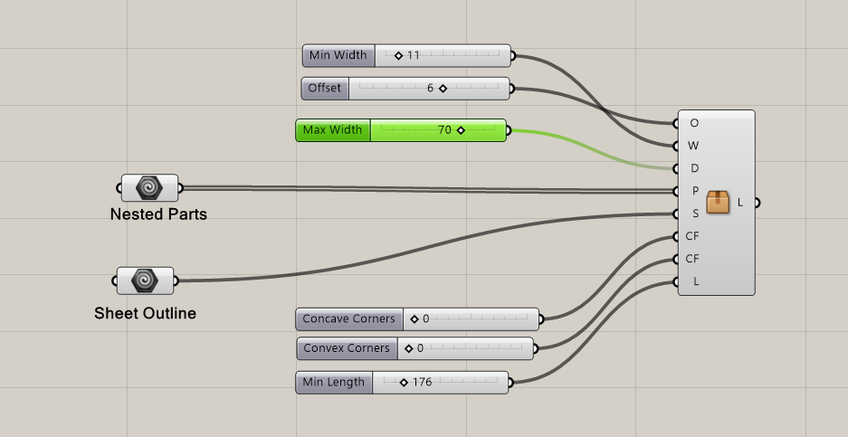

# Found Objects - Edge Generator
## A tool for generating material from CNC waste.

The Found Objects Edge Generator is a grasshopper definition that can be used to create "Found Object" parts in the space around the edge of a CNC sheet. The definition generates curves in between the edge of the sheet and the parts nested within the sheet, and gives several options for adjusting parameters of the curves. 

### Grashopper Definition

The defnition takes two types of geometry as input. The "Sheet Outline" is a rectangle that defines the outer dimensions of the sheet material. 

The "Nested Parts" geometry component contians the parts to be manufactured as closed polysurfaces. 

(Add image of sheet boundry and parts)

The Edge Generator has several inputs for adjusting parameters of the generated curves:

- Min Width:
	+ This specifies the minimum allowable with of the generated part. The default minimum value is 15mm. Using a width less than this will lead to fragile parts.
- Offset:
	+ This is the offset between the generated part and the nested parts - determined in part by the size of the milling bit. 
- Max Width:
	+ This is the maximum width of the generated parts. As a default, the max width is set to 60mm.
- Convave and Convex Corners:
	+ These values determine the fillet-type on the corners of the generated parts. 
		* 0: rounded corners
		* 1: chamfered corners
		* 2: corners are a direct offset of nested parts
- Min Length:
	+ This determines the maximum length of the generated parts. As a default the minimum is set to 200mm. 

### Example

### Credits
The Edge Generator was developed by Vincent Huyghe and [Ardeshir Talaei from [IAAC](https://www.iaac.net) as part of the [Better CNC Factory](https://betterfactory.eu/bcf) project. 
